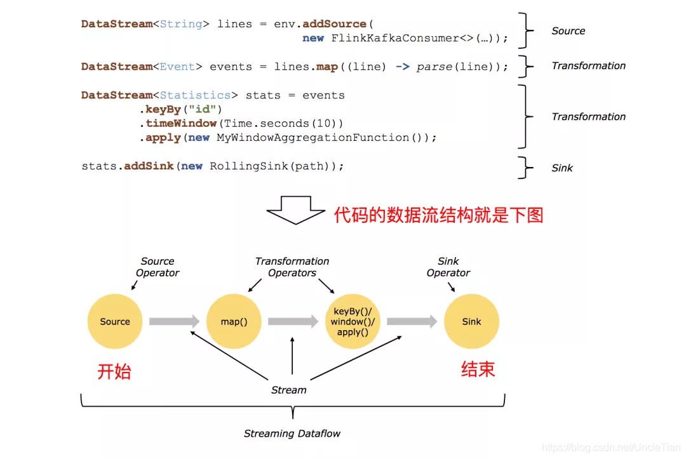

### 基本构成
Flink程序的基本构建块是流和转换。  
一个程序的基本构成：
- 获取execution environment
- 加载/创建原始数据
- 指定这些数据的转化方法
- 指定计算结果的存放位置
- 触发程序执行    


```
Source: 数据源，Flink在流处理和批处理上的source大概有4类：
    基于本地集合的 source、
    基于文件的 source、
    基于网络套接字的 source、
    自定义的 source。
自定义的 source 常见的有 Apache kafka、Amazon Kinesis Streams、RabbitMQ、Twitter Streaming API、Apache NiFi 等，当然你也可以定义自己的 source。

Transformation：
    数据转换的各种操作，有Map/FlatMap/Filter/KeyBy/Reduce/Fold/Aggregations/Window/WindowAll/Union/Window join/Split/Select/Project等，
操作很多，可以将数据转换计算成你想要的数据。

Sink：
    接收器，Flink 将转换计算后的数据发送的地点 ，
    Flink 常见的 Sink 大概有如下几类：写入文件、打印出来、写入 socket、自定义的sink 。
自定义的 sink 常见的有 Apache kafka、RabbitMQ、MySQL、ElasticSearch、Apache Cassandra、Hadoop FileSystem 等，同理你也可以定义自己的 sink。
```
 
### DataStreaming API使用

#### 获取execution environment
StreamExecutionEnvironment是所有Flink程序的基础，获取方法

```
getExecutionEnvironment()
createLocalEnvironment()
createRemoteEnvironment(String host, int port, String ... jarFiles)
```
    
一般情况下使用getExecutionEnvironment；  
在IDE或者常规java程序中执行可以通过createLocalEnvironment创建基于本地机器的StreamExecutionEnvironment；  
在已经创建jar程序希望通过invoke方式获取里面的getExecutionEnvironment方法可以使用createRemoteEnvironment方式。

#### 加载/创建原始数据 

StreamExecutionEnvironment提供的一些访问数据源的接口
  
**基于文件的数据源** 

```
readTextFile(path)  
readFile(fileInputFormat, path)  
readFile(fileInputFormat, path, watchType, interval, pathFilter, typeInfo)
```

**基于socket的数据源**

```
socketTextStream
```

**基于Collection的数据源**

```
fromCollection(Collection)
fromCollection(Iterator, Class)
fromElements(T ...)
fromParallelCollection(SplittableIterator, Class)
generateSequence(from, to)
```

#### 转化方法

**Map方式 DataStream -> DataStream**  
功能：拿到element并输出一个element，类似Hive的UDF函数

```
DataStream<Integer> dataStream = //...
dataStream.map(new MapFunction<Integer, Integer>() {
    @Override
    public Integer map(Integer value) throws Exception {
        return 2 * value;
    }
});
```

**FlatMap方式 DataStream -> DataStream**  
功能：拿到一个element，输出多个值，类似Hive的UDTF函数
```
dataStream.flatMap(new FlatMapFunction<String, String>() {
    @Override
    public void flatMap(String value, Collector<String> out)
        throws Exception {
        for(String word: value.split(" ")){
            out.collect(word);
        }
    }
});
```

**Filter方式 DataStream -> DataStream**  
功能：针对每个element判断函数是否返回true，最后只保留返回true的element
```
dataStream.filter(new FilterFunction<Integer>() {
    @Override
    public boolean filter(Integer value) throws Exception {
        return value != 0;
    }
});
```

**KeyBy方式：DataStream -> KeyedStream**  
功能：逻辑上将流分割成不相交的分区，每个分区都是相同key的元素
```
dataStream.keyBy("someKey") // Key by field "someKey"
dataStream.keyBy(0) // Key by the first element of a Tuple
```

**Reduce方式 KeyedStream -> DataStream**  
功能：在keyed data stream中进行轮训reduce。
```
keyedStream.reduce(new ReduceFunction<Integer>() {
    @Override
    public Integer reduce(Integer value1, Integer value2)
    throws Exception {
        return value1 + value2;
    }
});
```

**Aggregations方式 KeyedStream -> DataStream**  
功能：在keyed data stream中进行聚合操作
```
keyedStream.sum(0);
keyedStream.sum("key");
keyedStream.min(0);
keyedStream.min("key");
keyedStream.max(0);
keyedStream.max("key");
keyedStream.minBy(0);
keyedStream.minBy("key");
keyedStream.maxBy(0);
keyedStream.maxBy("key");
```

**Window方式 KeyedStream -> WindowedStream**  
功能：在KeyedStream中进行使用，根据某个特征针对每个key用windows进行分组。
```
dataStream.keyBy(0).window(TumblingEventTimeWindows.of(Time.seconds(5))); // Last 5 seconds of data
```

**WindowAll方式 DataStream -> AllWindowedStream**  
功能：在DataStream中根据某个特征进行分组。
```
dataStream.windowAll(TumblingEventTimeWindows.of(Time.seconds(5))); // Last 5 seconds of data
```

**Union方式 DataStream -> DataStream**  
功能：合并多个数据流成一个新的数据流
```
dataStream.union(otherStream1, otherStream2, ...);
```
**Split方式 DataStream -> SplitStream**  
功能：将流分割成多个流
```
SplitStream<Integer> split = someDataStream.split(new OutputSelector<Integer>() {
    @Override
    public Iterable<String> select(Integer value) {
        List<String> output = new ArrayList<String>();
        if (value % 2 == 0) {
            output.add("even");
        }
        else {
            output.add("odd");
        }
        return output;
    }
});
```
**Select方式 SplitStream -> DataStream**  
功能：从split stream中选择一个流
```
SplitStream<Integer> split;
DataStream<Integer> even = split.select("even");
DataStream<Integer> odd = split.select("odd");
DataStream<Integer> all = split.select("even","odd");
```

#### 输出数据
```
writeAsText()
writeAsCsv(...)
print() / printToErr() 
writeUsingOutputFormat() / FileOutputFormat
writeToSocket
addSink 
```

### [计算实时热门商品](http://wuchong.me/blog/2018/11/07/use-flink-calculate-hot-items/)

详见[HotItems](./src/main/java/cn/xiaoyu/flink/HotItems.java)

每隔5分钟输出最近一小时内点击量最多的前N个商品

数据结构：
```
用户ID	     整数类型，加密后的用户ID
商品ID	     整数类型，加密后的商品ID
商品类目ID    整数类型，加密后的商品所属类目ID
行为类型	     字符串，枚举类型，包括(‘pv’, ‘buy’, ‘cart’, ‘fav’)
时间戳	     行为发生的时间戳，单位秒
```

### 教程    
[Apache Flink 零基础系列教程](https://developer.aliyun.com/article/753999)